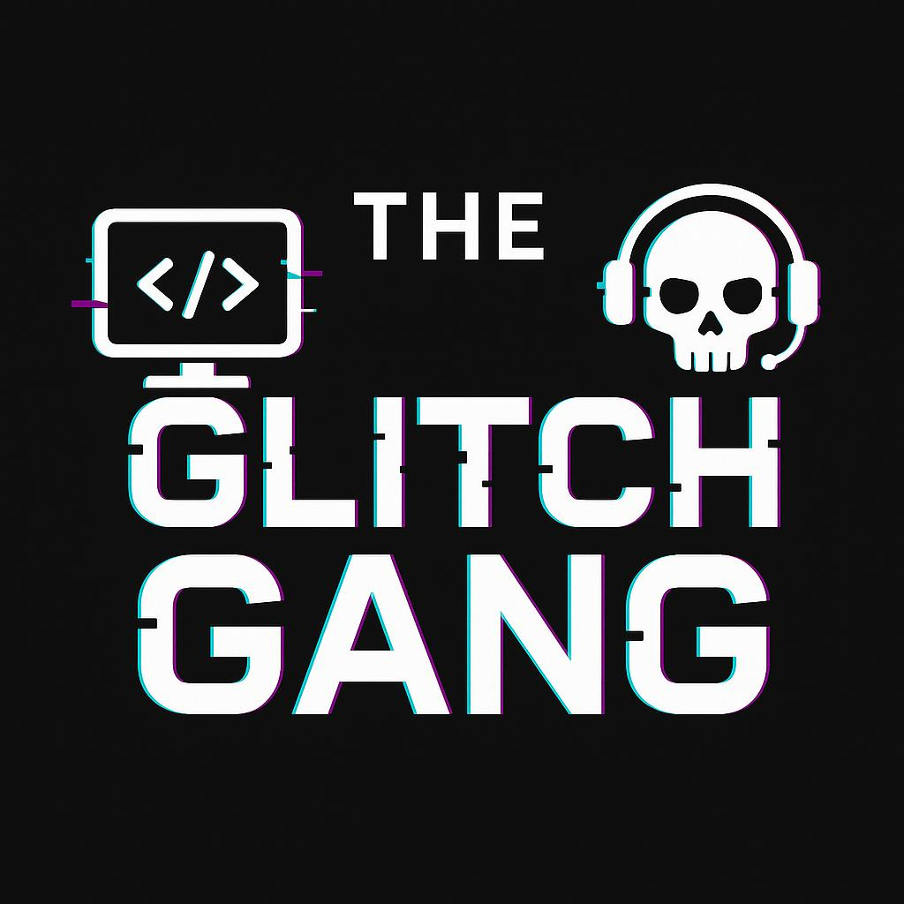

<p align="center">
  
</p>

<h1 align="center">Technix CRM Redesign</h1>
<p align="center"><em>By Team The Glitch Gang — Aanya, Yashika & Shivani</em></p>

# Technix CRM Redesign

A redesigned front-end interface for a CRM (Customer Relationship Management) system. This project focuses on creating a modern, clean, and user-friendly layout using HTML, CSS, and JavaScript.

## 🚀 Project Overview

This project is a redesign initiative aimed at improving the user interface and experience of a CRM dashboard. It features:
- Responsive layout
- Clean visual structure for CRM functionalities
- Updated UI components and icons
- Improved visual hierarchy
  
## 🌟 Key Features

- Fully responsive layout with smooth navigation  
- Modular CRM sections — Lead Management, Contact Management, Campaigns, etc.  
- Functional "Get a Demo" form with **JS validation** and error handling
- Clean HTML5 + Tailwind CSS design system  
- Visual hierarchy & intuitive content structure  
- Mobile-first UX — works beautifully on phones, tablets, and desktops  
- Real-time feedback for form errors/success  
- Organized and scalable folder structure  
- Privacy links and accessibility-ready layout
  
## 🛠️ Tech Stack Used

- **HTML5** – for markup structure
- **CSS3** – for styling and layout (Flexbox, Grid)
- **JavaScript (Vanilla)** – for basic interactivity
- **[Optional: Add any libraries/frameworks if used]**
- **Assets** – Icons and illustrations used for CRM modules

## 📁 Folder Structure

technix-crm-redesign/
├── index.html
├── scripts/
│   └── form.js
├── styles/
│   └── style.css
├── assets/
│   └── images/
│       ├── banner-img.gif
│       ├── productivity.png
│       ├── clv.png
│       ├── collaboration.png
│       ├── lead-management.png
│       └── strp.png
└── README.md
└── LICENSE

## 📬 Contact

For feedback, suggestions, or collaborations:  
**Aanya Kathuria** – [LinkedIn] (https://www.linkedin.com/in/aanya-kathuria-6071a8326/)
**Yashika Kansal** – [LinkedIn] (https://www.linkedin.com/in/yashika-kansal-1829b7233/)
**Shivani Bansal** – [LinkedIn] (https://www.linkedin.com/in/shivani-bansal-46546433b/)

Feel free to open an issue or drop a message.
Proudly representing The Glitch Gang 

## 📁 Credits
- Illustrations and Images: All visual assets used in this project are sourced from Freepik.
Please consider supporting the creators on Freepik for more awesome content.
- Design: Redesigned by Aanya Kathuria, Yashika Kansal and Shivani Bansal
- Inspiration: Based on the concept provided by the Technix team

## 🎥 Live Demo

**🔗 View Project Here**  
🌐 [https://aanyakathuria.github.io/technix-crm-redesign/](https://aanyakathuria.github.io/technix-crm-redesign/)


## 🖥️ How to Run Locally

**Step 1:** Clone the repository  
```bash
git clone https://github.com/aanyakathuria/technix-crm-redesign.git
```
**Step 2:** Navigate into the project
```bash
cd technix-crm-redesign
```

## 📌 License
This project is licensed under the MIT License — feel free to use, adapt, and credit us when sharing

